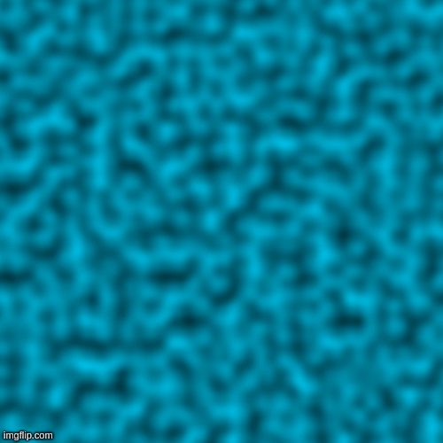

# Perlin Noise
An implementation of Ken Perlin's noise algorithm intended for procedural texture generation.

## Description
This project consists of an implementation of the Perlin Noise algorithm as well as some utilities to save the generated textures as images. Specifically the noise generated here is 3 dimensional, although modifying the code to account for more dimensions is fairly straightforward. 

The core of the project is the PerlinNoise class where methods that can map a point (in either 2D or 3D) space to a noise value (real number between -1 and 1) can be found. Furthermore a PpmImage class is also provided to create, manipulate and store PPM images. Last but not least, in the Main class of this project examples can be found as to how that noise can then be used to create a single  texture or even a sequence of frames that can be then stiched to create an [animated](animatedTexture.gif) texture.

## Contribution Guidelines
Please feel free to improve this project. If you decide that you want to contribute here is a few things to keep in mind:
* Add JavaDoc to your methods.
* Write JUnit tests for every method that it is possible (aim for a high branch coverage/parts of code that depend on randomness can be ignored).
* Pull requests should have a short description explaining what you added/changed and why.

In any case thank you for checking out this short project :).

## References

### Websites/Posts
* The (excellent) Scratch a Pixel Blog posts about [noise](https://www.scratchapixel.com/lessons/procedural-generation-virtual-worlds/procedural-patterns-noise-part-1), in general, and [Perlin Noise](https://www.scratchapixel.com/lessons/procedural-generation-virtual-worlds/perlin-noise-part-2) specifically.
* [Understanding Perlin Noise](https://adrianb.io/2014/08/09/perlinnoise.html) by adrian's soapbox.
* [The Wikipedia page](https://en.wikipedia.org/wiki/Perlin_noise) on Perlin noise.

### Videos
* The [One Lone Coder](https://www.youtube.com/watch?v=6-0UaeJBumA&t=1208s) video on "Perlin-Like" noise.
* The [Coding Train](https://www.youtube.com/watch?v=Qf4dIN99e2w) series on Perlin Noise.
